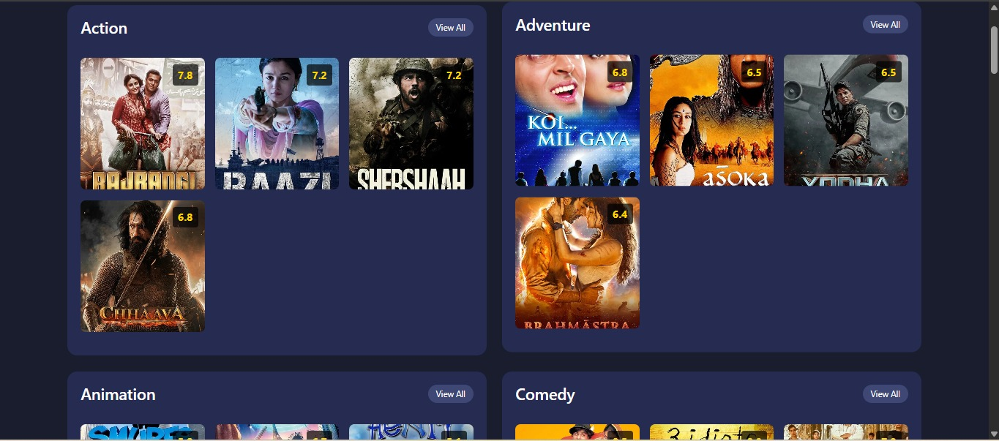

# 🎬 Movie Recommender System using Flask & TMDB

A web-based movie recommendation application that helps users discover similar films using content-based filtering. Built using Flask, scikit-learn, and TMDB datasets, this app combines natural language processing and machine learning to deliver movie suggestions based on user preferences.

---

## 📸 Demo
1] Dashboard :


2] Categories :


3] Inside_Categories :


4] Recommendation for particular movie  :


---

## 🚀 Features

- 🔍 Search for movies by title
- 📄 View detailed information about each movie (genre, overview, poster)
- 🎯 Receive similar movie recommendations
- 🤖 Uses NLP and cosine similarity for content-based filtering
- 💻 Responsive and clean UI built with Bootstrap

---

## 🧠 Tech Stack

- **Python** – Core programming language
- **Flask** – Web framework
- **scikit-learn** – Vectorization and cosine similarity
- **Pandas** – Data preprocessing
- **NLTK** – Text processing
- **Bootstrap** – Frontend UI
- **TMDB API + Dataset** – Movie metadata and posters

---

## 🗂️ Project Structure


## Project Structure

```
app.py
model_builder.py
movies.pkl
similarity.pkl
tmdb_5000_credits.csv
tmdb_5000_movies.csv
static/
    css/
        style.css
    images/
        movie-banner.jpg
templates/
    base.html
    categories.html
    category_movies.html
    index.html
    movie_details.html
    search_results.html
    search.html
```

## Setup Instructions

1. **Clone the repository**
    ```sh
    git clone https://github.com/yourusername/movie-recommender-app.git
    cd movie-recommender-app
    ```

2. **Install dependencies**
    ```sh
    pip install -r requirements.txt
    ```

3. **Download NLTK data**
    ```sh
    python -m nltk.downloader stopwords wordnet
    ```

4. **Prepare the model**
    - Run the model builder to generate `movies.pkl` and `similarity.pkl`:
    ```sh
    python model_builder.py
    ```

5. **Run the Flask app**
    ```sh
    python app.py
    ```

6. **Open in browser**
    - Visit [http://127.0.0.1:5000](http://127.0.0.1:5000)

## Data Sources

- [TMDB 5000 Movie Dataset](https://www.kaggle.com/datasets/tmdb/tmdb-movie-metadata)

## Acknowledgements

- [TMDB](https://www.themoviedb.org/) for movie data and images
- [scikit-learn](https://scikit-learn.org/)
- [Flask](https://flask.palletsprojects.com/)

## License

This project is licensed under the MIT License.


## 👨‍💻 Author

**Harshal Shirole**  
Feel free to connect with me on [LinkedIn](https://www.linkedin.com/in/harshal-shirole-742824278/) or check out my other projects on [GitHub](https://github.com/Harshal-2004).


Let me know if you want help creating a GIF preview or want to deploy this online.
